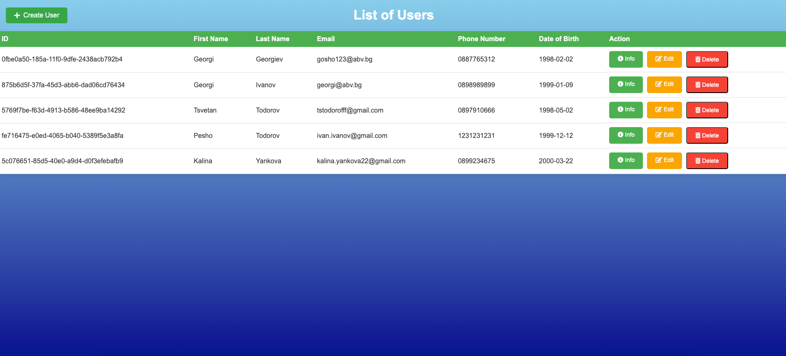
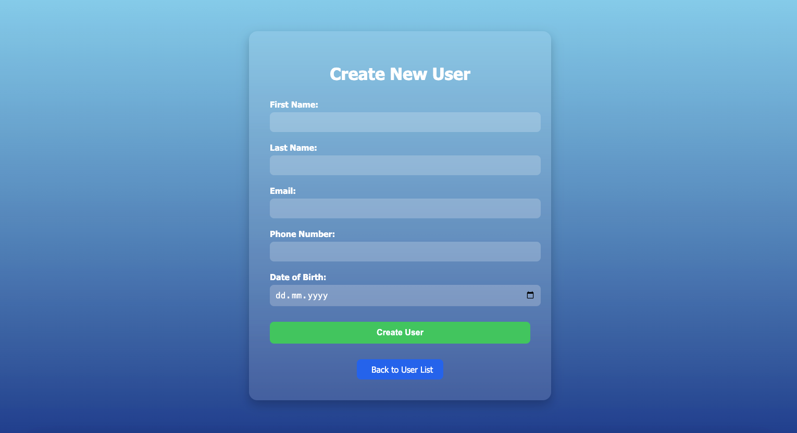
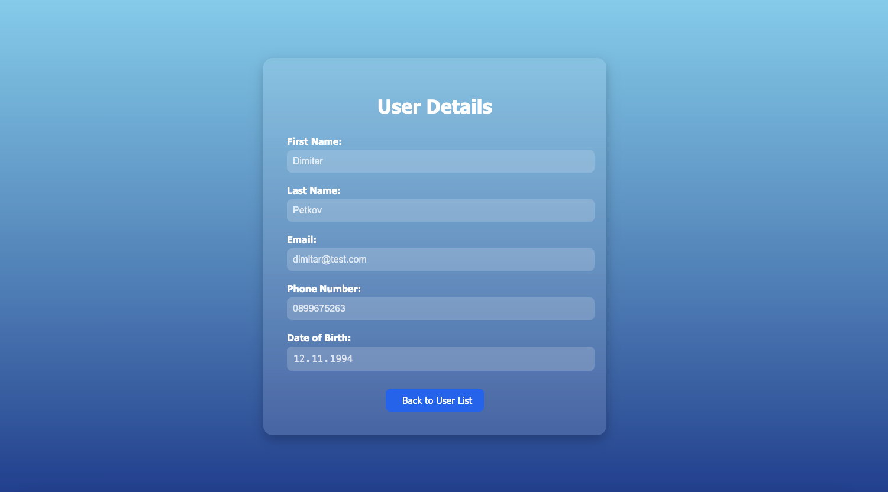
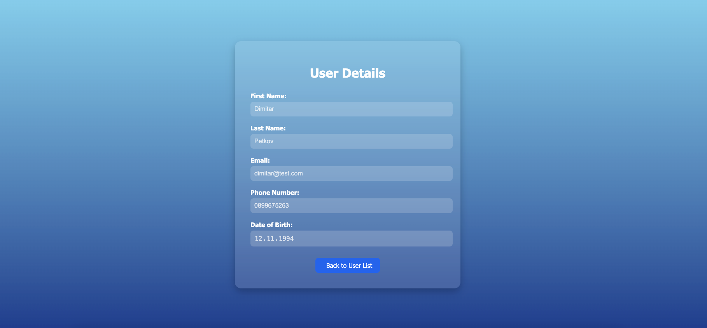
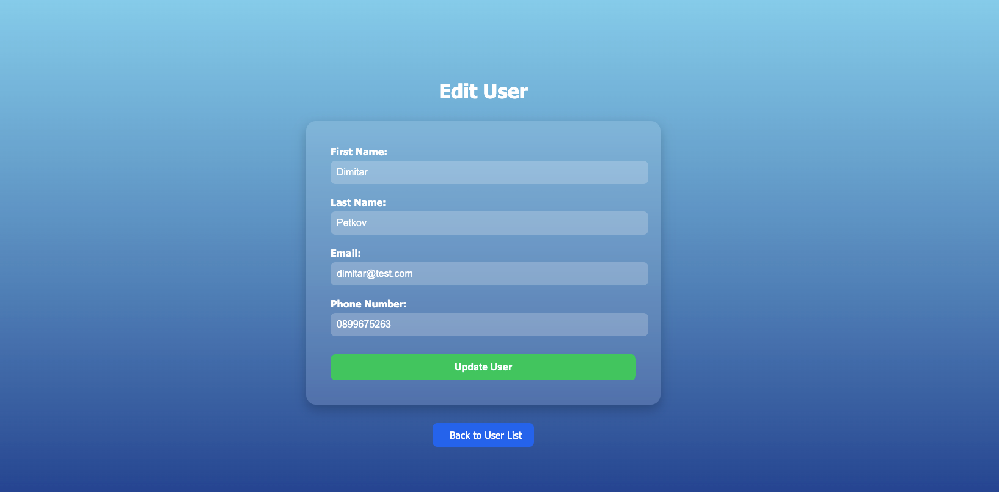

# 🧾 user_mvc - User Management Spring MVC Project

This is a simple Spring MVC project designed for managing users, implementing the full CRUD (Create, Read, Update, Delete) functionalities. The project is integrated with the "user_svc" RESTful API using Feign Client for seamless communication and data exchange between the two services.

---

## 🚀 Tech Stack

- **Java 21**
- **Spring Boot 3**
- **Spring Security**
- **HTML**
- **THYMELEAF**
- **CSS**
- **FEIGN CLIENT**
- **Lombok**
- **Maven**

---

1. **Clone the repository (Or download its zip file):**

- https://github.com/TsvetanTodorov/user-mvc.git

--- 

## 🌐 API Endpoints

## 📄 List Of Users

- **The first endpoint of the application provides a user list displayed in a table format. This table presents all the users currently stored in the system**

- **At the top of the user list table, there is a "Create User" button. Clicking this button will redirect the user to a form where new user details can be entered.**

---

## 🚀 Create User

- **Upon submission, the newly created user will be added to the system, and the user list will be updated accordingly.**

---

## 📝 User Details

- **Upon successfully creating a user, the application will automatically redirect to the User Details page. This page provides a comprehensive view of the newly created user's information**

---

## 🔙 Back to User List
- **After viewing the User Details page, clicking the "Back to User List" button will redirect you back to the User List page. This page displays the table with all users in the system, allowing you to view and manage the users effectively.**

---

## 💼 User Info

- **On the User List page, each user in the table has an associated "Info" button. Clicking this button will provide detailed information about that specific user, allowing for a deeper view of their profile**

---

## ✏️ Edit User

- **On the User List page, each user in the table has an "Edit" button. Clicking this button will redirect you to a new view where you can modify the user’s details.**

- **Once you have made the desired changes, you can click the "Update User" button to save the modifications. After the update is successful, the application will automatically redirect you back to the User List page, where the table will display the updated information for that user.**

---

## 🗑️ Delete User

- **On the User List page, each user row includes a "Delete" button. When you click this button, a confirmation prompt will appear, asking if you are sure you want to delete the selected user.
If you confirm by clicking Yes, the user will be permanently deleted from the system, and the User List page will reload, reflecting the updated list without the deleted user.**